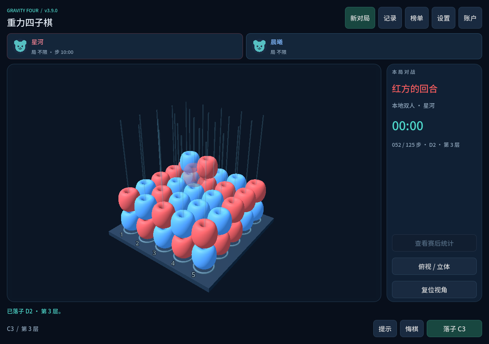
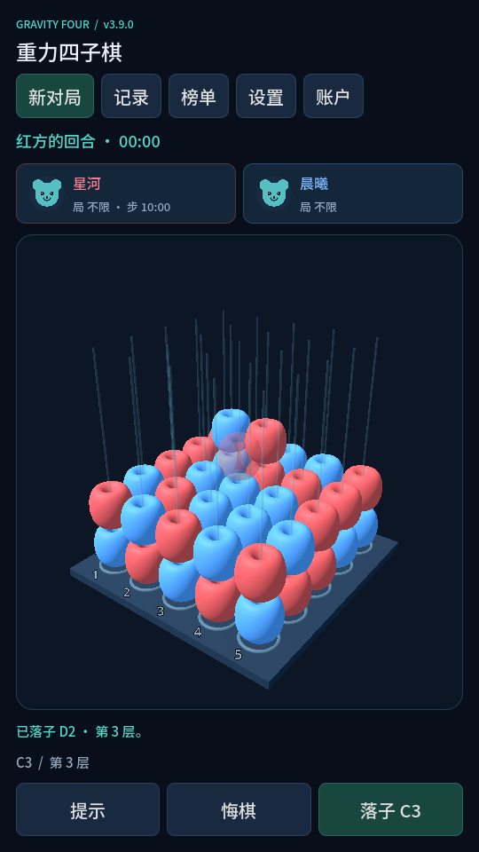
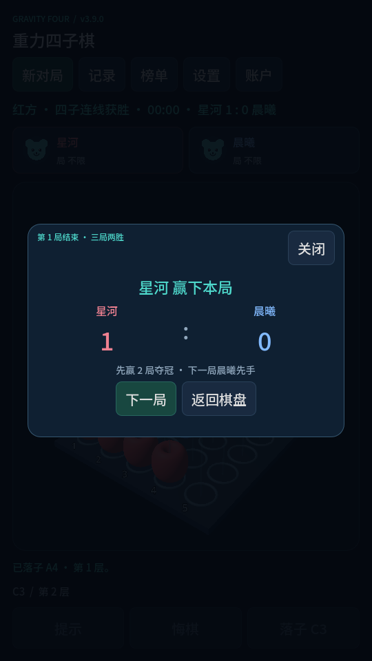
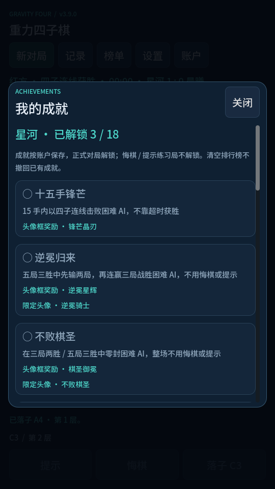
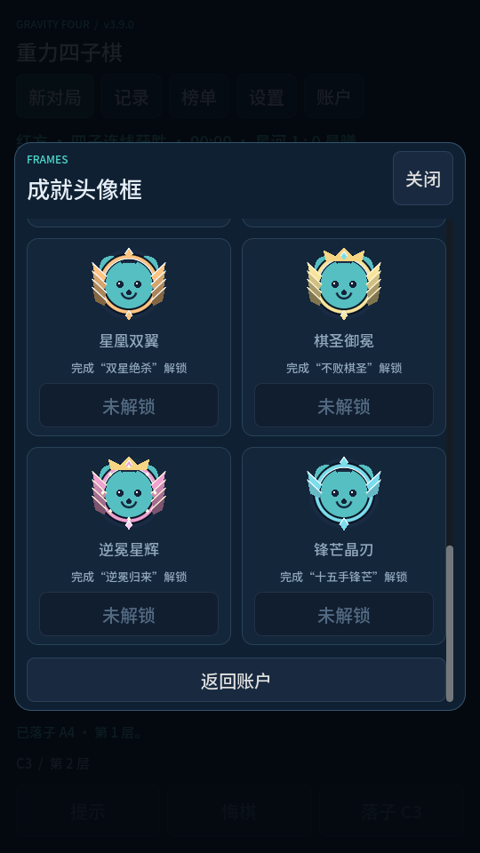

# 三维重力四子棋 · Windows / Android 3.9

使用 Godot 4.7.2 / GDScript，共用棋盘、AI 与联机代码，提供 Windows 原生 EXE 和已签名 Android APK。

项目仓库：[and4s/GravityFour](https://github.com/and4s/GravityFour)。仓库保存源码、素材、测试和构建脚本；Windows / Android 安装包不放入 Git 历史，安装包见 [v3.9.0 正式 Release](https://github.com/and4s/GravityFour/releases/tag/v3.9.0)。

## 游戏截图

以下为 v3.9 的演示对局与界面截图；移动端布局由桌面模拟预览生成。

**Windows 三维棋盘**



<table>
  <tr>
    <th>手机竖屏布局</th>
    <th>系列赛比分结算</th>
  </tr>
  <tr>
    <td align="center"></td>
    <td align="center"></td>
  </tr>
  <tr>
    <th>成就挑战</th>
    <th>成就头像框</th>
  </tr>
  <tr>
    <td align="center"></td>
    <td align="center"></td>
  </tr>
</table>

## 安装与开始

作者已完成 **Android 真机运行及跨设备联机验证**。

Windows：解压 Windows v3.9 压缩包，双击 GravityFour.exe，无需安装引擎。需要 Windows 10/11 x64、支持 OpenGL 3.3 的显卡。

Android：将 GravityFour-v3.9.apk 复制到手机安装。需要 Android 7.0 或更高、ARM64 / ARMv7 与 OpenGL ES 3.0。系统可能要求允许本次文件来源安装。APK 为正式签名包，包名 org.gravityfour.game。后续更新需使用相同签名。手机与 Windows v3.9 可使用同一联机协议；3.9 双方互相兼容，与 3.8 及更早版本不兼容。

首次进入为本地双人棋局，顶部“新对局”可切换本地、AI 和联机；“账户”注册或切换用户。

## 棋盘和操作

- 5×5×5，共 125 个位置。重力固定向下。任意空间方向连续四枚同色棋子获胜，填满而无连线则平局。
- 移除了 25 个重复选柱按钮。直接点击三维底座选柱，预览最低空位，然后按“落子”。在设置关闭二次确认后，点击即落子。
- 桌面：左键点击选柱，左键或右键拖动旋转，滚轮缩放。Enter / 空格确认，Ctrl+Z 悔棋，Esc 打开设置 / 关闭页面。
- 安卓：点选、单指拖动旋转、双指捏合缩放；横竖屏自动调整。返回键关闭页面 / 打开设置。
- “设置”提供音效开关、音量、二次确认、困难 AI 思考时间（1～8 秒）、俯视 / 立体和视角复位。
- 棋盘和基础玩法参考《最强大脑》第六季。采用原创界面、音效与代码，未使用节目画面或标识。

## 悔棋与提示

本地双人每次撤回最后一步。AI 模式撤回到自己的上一回合：AI 已回复则撤回双方最近两步；正在思考时撤回自己的这一步，同时取消该次搜索。已经结束的对局不能悔棋。

联机任何一方都可以申请，必须由另一方点击“同意”。申请期间暂停落子和计时；拒绝、关闭请求窗口、30 秒未答复或断线都不执行悔棋。发起者不能批准自己的申请；过期棋局、步数或申请编号会被拒绝。

“提示”仅在本地 / AI 模式可用，分析建议落点，不自动落子。悔棋 / 提示后本局标记“练习”，结束后保留记录，但双方不计排行榜。悔棋不退回已经花费的思考时间。

## AI

- 简单：识别直接获胜、单步防守，根据中心控制、连线潜力和重力支撑评价安全落点；仅在两个候选评分接近时少量变化，增强开局但保留入门难度。
- 普通：前 14 手预算 1.4 秒、最多 6 层；之后预算约 1.05 秒、最多 5 层，保留直接攻防判断。
- 困难：开局使用设置预算（桌面默认 4 秒、安卓默认 3 秒）、最多 11 层；14 手后预算乘以 0.75、最多 8 层。
- 大师：至少 8 秒搜索预算，最多 13 层；识别直接胜负时可以提前返回。

重写了搜索器：迭代加深、Alpha-Beta、增量评分、置换表、强制威胁延伸、双重威胁识别、危险支撑位置判断。移除旧版非根节点仅搜索 12 个候选的限制。实际完成深度取决于局面和设备；不是保证必胜的求解器。AI 在工作线程中运行，旋转镜头不受影响；切换模式、重开和悔棋会取消旧搜索。

## 唯一用户名和数据

用户名注册为 2～16 字，英文字母不区分大小写；不能含控制字符或以 AI 开头。重复注册会拒绝，可切换到已注册用户。本地双人需选不同用户，联机客机不能与主机重名。修改用户在下一局生效，客机改名需重新加入。

最多注册 3 个账户；旧数据已有超过 3 个账户时保留，但需删除至低于上限才可新注册。唯一性范围是本机注册列表和当前房间。当前为离线账号，没有云认证服务，无法保证不同设备的用户名在全球唯一。排行榜也是本机数据，不跨设备同步。

沿用 profiles_v2.json 数据文件并自动迁移 v2 注册信息，替换 EXE 不清空旧成绩。Windows 文件位于 %APPDATA%/Godot/app_userdata/重力四子棋 · Gravity Four/；Android 位于应用私有数据目录，卸载通常清除数据。

## 记录、统计和排行榜

完成一局后自动显示获胜者、双方步数、思考用时、悔棋次数和最近落子。记录页面可查看完整落子顺序，使用卡片布局，支持删除某一局 / 全部清空，均有确认。删除记录保留累计成绩。

胜 3 分、平 1 分、负 0 分，按 AI 四档、本地和联机分别排行。本地记录双方，AI 仅记录人类，联机仅记录各自本机玩家。排行榜可删除某名用户在当前模式的成绩，或清空当前榜单；其他模式、账号和对局记录保留。练习局不计分，中途退出 / 重开不计分。删除过的同一对局仍不会重复计分。

## 联机：局域网、SakuraFrp、虚拟网络

1. 在“新对局 → 局域网联机”，主机设置端口（默认 UDP 24567）和可选口令，创建房间。
2. 客机输入主机 IPv4 / 域名、相应端口和口令，加入房间。地址不带协议、路径或 :端口。
3. 主机执红棋，客机执蓝棋；每局开始前由主机设置红方先手、蓝方先手或轮换先手。主机防火墙需允许该 UDP 端口。

同一 Wi-Fi / 局域网：使用主机 WLAN / Wi-Fi 网卡的 IPv4，网络需允许设备间通信；访客网络或 AP 隔离可能阻止连接。房间展示每个网卡的名称和地址，多个地址来自多张网卡，例如 Wi-Fi 和 Radmin VPN；虚拟网卡地址只有双方处在同一虚拟网络才可使用。默认端口 UDP 24567，主机需放行防火墙。

SakuraFrp：主机设置 UDP 隧道，本地地址 127.0.0.1、本地端口为游戏端口。客机填写隧道域名和远程端口。TCP 隧道不适用。安卓客机可以加入 Windows 主机。

Radmin VPN：Windows 双方进入同一虚拟网络后，填写主机虚拟 IP。手机需要支持 Android 的虚拟网络工具，并与主机处于同一虚拟网络；Radmin VPN 不作为本项目的 Android 连接方案。

客机断开，主机保留棋局等待重连；重新加入后恢复棋盘、轮次与结果。一个房间只容纳一名客机，重新加入者接管蓝方，没有云身份绑定。结束后双方点击再来一局才开始下一局；主机可解散房间，客机可退出房间。房间口令用于入房校验，ENet 数据不加密。无自动房间发现。

## 源代码和构建

- scripts/board.gd：规则、302 条四子线段、快照。
- scripts/board_view.gd：三维棋盘、动画、镜头与选柱。
- scripts/game.gd：对局、线程、主机裁定、协商悔棋、重连。
- scripts/ui_shell.gd：中文卡片界面、设置、账号、横竖屏与安全区适配。
- scripts/ai.gd：新版 AI 搜索器。
- scripts/profiles.gd：注册、迁移、记录 / 排行、删除和去重。
- audio/ 与 scripts/sfx.gd：原创合成音效。
- fonts/：Noto Sans SC Medium，SIL OFL 许可，避免 Android 中文缺字。

打开 project.godot 可编辑，Open-Editor.bat 可启动已下载的引擎。

```powershell
.\Test-Windows.ps1
.\Build-Windows.ps1
.\Build-Android.ps1
```

Windows 输出 dist/v3.9/GravityFour.exe；Android 输出 dist/android/GravityFour-v3.9.apk。
Android SDK 位于 tools/android-sdk，Java SDK 使用本机 Zulu 21；本机 Godot 编辑器已配置路径。签名密钥和密码在 tools/ 内，未包含在游戏发行包或源码压缩包中。持续发布更新应单独安全备份密钥与密码。Build-Android.ps1 通过环境变量传递签名信息，构建日志不输出密码。

Android 构建配置参考 Godot 官方文档：https://docs.godotengine.org/en/stable/tutorials/export/exporting_for_android.html 。

验证：751 项棋盘检查、59 项 AI / 用户 / 数据 / 悔棋集成检查、20 项房间界面 / 回看 / 更新检测检查、24 项性能设置 / 渲染回归检查、26 项触摸 / 输入 / 选择 / 双击 / 滚动检查；真实 ENet 双进程检查用户名冲突、认证、非法落子、重连、结算和悔棋同意 / 拒绝 / 超时 / 断线 / 过期答复；实际 OpenGL 横竖屏截图；Windows 导出启动及 APK 签名、架构、权限、包名与屏幕方向检查。

作者已完成 Android 真机运行及跨设备联机验证。上述自动化测试与作者的真机验证互为补充；SakuraFrp / VPN 能否连接仍取决于双方网络和工具配置。

项目 MIT 许可见 LICENSE。发行包含 Godot 许可和版权声明；字体许可见 fonts/OFL.txt。

## 手机输入与双击落子

恢复触摸转鼠标事件，使输入框获得焦点并调用输入法；棋盘过滤模拟鼠标事件，避免触摸重复落子。Android 的用户、难度、先后手和榜单选择改为页面内的可滚动选项列表，不使用原生弹出下拉窗口。

Windows 和 Android 的“设置 → 操作与思考”增加“双击同一柱位直接落子”。开启后，首次点击选柱，0.5 秒内再次点击同一位置（同一柱、距离不超过 28 个界面像素）确认落子。超时、换位置、拖动、缩放、换局或已落子不会误触发，也可按落子按钮确认。该设置优先于单击即落子设置，默认关闭并自动保存。

提示只允许本地双人和 AI；联机时隐藏按钮，后端拒绝请求，取消旧的提示搜索。当前双方需使用 3.9 联机。APK 使用相同签名、同一包名和更高版本号，可覆盖更新以保留用户数据。

## 页面滑动、删除用户与棋盘辅助

修复安卓设置、记录、榜单等页面的卡片 / 按钮阻断滑动：触控事件向滚动容器传递，12 像素滑动阈值避免误操作；滑动时取消按钮点击，页面切换回到顶部。输入框焦点与手机选择列表保留。

账户页增加删除当前选中用户。确认后删除用户及其所有模式成绩，保留对局记录和去重信息；设置切换到剩余用户，至少保留一名用户。正在参与的对局 / 联机用户不能删除。只剩一名用户的初始本地棋局由临时访客陪同（访客不计分）；通过新对局开始正式本地双人仍需注册两个不同用户。

参考节目相关棋具的红蓝算盘珠外观（参考图片与说明：https://www.sohu.com/a/341905712_136745 ），改为穿柱棋珠，列间距 0.9、棋珠直径 0.86、垂直厚度约 0.80，缩小空隙。相邻同色棋珠之间显示细连接线，帮助查看平面和空间对角线；设置中可以关闭。辅助线只表示相邻同色关系，连续四子胜利仍由独立规则判定并用白线显示，不改变棋盘坐标、重力和规则。

AI 仅在空棋盘使用中心首手；其他开局通过搜索决定落点，加入早期可落子连线潜力评价、重力可达性与对称局面缓存。普通最多六层 / 1400 毫秒，困难最多十一层，大师最多十三层 / 至少八秒；实际深度取决于设备与局面，不保证必胜。

3.2 APK 继续使用同一包名和发行签名，可覆盖更新保留数据；联机协议升级为 9，双方需使用 3.9。滑动回归使用触摸转鼠标及触屏模拟在桌面驱动下验证；作者已完成 Android 真机运行及跨设备联机验证。

## 项目目录与维护

- `scripts/`：游戏源码。
- `audio/`、`fonts/`、`assets/`：音效、实际使用的字体与版权许可。
- `tests/`：回归测试、截图脚本与平局数据。
- `tools/`：引擎、SDK、导出模板、安卓签名与维护工具，详见 `tools/README.md`。
- `dist/v3.9/`：当前 Windows EXE 和发行许可。
- `dist/android/`：当前 Android APK 和说明。
- 根目录两个 v3.9 ZIP：当前 Windows / 源码分发包；校验清单位于 `dist/release-v3.9-checksums.json`。
- `.artifacts/`：生成的日志与截图，不进入发行包。
- `project.godot` / `main.tscn`：项目入口；根目录 PS1 / BAT 提供构建、测试、编辑与启动。

旧版发布目录、旧压缩包、开发日志、临时截图、一次性修改脚本和未使用的字体已清理。`.godot/` 为引擎自动生成的缓存；构建与测试会先导入项目。用户和对局记录存储在应用数据目录，不属于项目清理范围。

运行 `python tools/package.py` 更新 Windows / 源码 ZIP 和校验清单。完整构建顺序为 Windows 构建、Android 构建、打包；仅修改说明或目录时可直接重新打包。测试日志集中到 `.artifacts/logs/`，截图脚本输出到 `.artifacts/screenshots/`。
## 性能与画面

设置新增“性能与画面”：30 / 60 / 90 / 120 FPS / 不限帧，默认 60 FPS；垂直同步默认开启；后台限帧默认开启，失焦时上限 30 FPS，返回前台恢复所选上限。设置立即生效并自动保存，设置卡片显示当前实际 FPS。垂直同步开启时仍受屏幕刷新率限制，不限帧也不能保证超过刷新率。

省电画质把三维棋盘的渲染宽高各减半，并减少棋珠模型细分；界面文字保持原分辨率，落子坐标经过转换。后台限帧不会主动暂停联机和 AI，但 Android 系统可能挂起后台应用。

静止棋盘复用已渲染画面，旋转、缩放、选柱、落子、悔棋、画质、连线和窗口尺寸变化时更新；落子动画期间持续渲染。界面定时刷新降为每秒 4 次，操作与对局状态变化仍即时刷新。共享网格和预览材质；25 根柱、辅助线采用批量绘制（3.9 已移除钢柱刻度环），降低刻度与细线模型细分。

同一台 Windows 电脑（RTX 3050 Laptop，OpenGL 3.3），1280×900、相同满盘平局局面、标准画质、持续渲染、预热 30 帧后采样 60 帧：绘制调用从 802 降为 175，渲染图元从 1,099,060 降为 247,028。该对比不代表 FPS 提升比例或手机实际能耗；Android 真机续航与 GPU 表现尚未验证。

实现参考：[帧率与垂直同步](https://docs.godotengine.org/en/stable/classes/class_engine.html#class-engine-property-max-fps)、[MultiMesh 批量绘制](https://docs.godotengine.org/en/stable/classes/class_multimesh.html)。

## 3.9 房间、回看与更新

悔棋确认采用小弹窗；联机结算只显示自己的输赢与简要数据，提供再来一局及退出 / 解散房间。双方都准备后由主机开始下一局，旧局或无效的准备请求会拒绝。房间内显示双方在各自设备保存的联机累计局数与胜率，练习局不计分；它不是服务器认证的全球战绩。

连线辅助在新安装 / 没有已保存设置时默认关闭；原用户已选择的开关继续保留。最多注册 3 个账户，删除后可重新注册。

点击记录详情直接还原独立三维棋盘；可逐步回放、旋转与缩放，使用“退出回看 · 返回记录”、关闭或返回键退出。当前对局不会被覆盖。新记录保存结构化落子与最终快照，旧记录尽可能从原落子文字还原，缺失数据时给出提示。

“关于 / 作者 / 检查更新”展示版本、作者和支持作者入口。作者为 and4s，仓库与更新地址固定为 and4s/GravityFour。赞赏码已内置于“设置 → 支持作者 / 赞赏码”；发布步骤见 docs/GITHUB发布.md。更新检测使用最新正式 Release，打开页面手动下载安装，不自动替换文件。当前版本 3.9.0，安卓 versionCode 12，沿用原签名与包名。网络协议升级为 9，联机双方需使用 3.9。

## 3.9 难度、提示、模式与成就

提示使用同一大师搜索器，预算至少 4 秒，展示建议落点、理由及完成的搜索深度。普通也加强早期布局搜索。

“新对局”只保留经典四子棋和系列赛。系列赛选择三局两胜或五局三胜，先赢两局 / 三局夺冠；平局不计胜局并加赛，每一局（包括平局后）固定轮换先后手，第一局红方先行。系列赛开始后锁定参与者、AI 难度及计时规则，结束后可以重新开赛；中途退出保留已完成单局记录，不颁发系列赛奖励。联机双方准备后开始下一局，主机统一裁定结果与比分。

经典、三局两胜、五局三胜按四档 AI、本地与联机分别计分，统一汇总至总榜。旧快棋与旧轮换成绩合并至经典，历史记录保留。成就入口移至账户页面，目前 18 项；新增六个技巧挑战：后手击败困难 AI、空间对角线击败困难 AI、双线绝杀困难 AI、系列赛零封困难 AI、五局赛 0:2 逆转困难 AI、十五手内击败困难 AI。解锁五款原创战甲头像和六款头像框。提示 / 悔棋练习局不奖励；系列赛奖励要求整场未使用辅助。清空记录和榜单保留奖励，删除账户同步删除。

结算以居中大字显示自己的输赢：金色胜利、红色落败、蓝色平局，同时显示新成就和下一局操作。历史回放保留蓝方先手及超时终局。

## 头像与校园网

账户页面提供 8 个自由使用的动物头像与 5 个挑战解锁的原创战甲头像；按账户保存，联机入房、重连与更换时同步。头像采用内置绘制，不读取相册。

再来一局、退出 / 解散房间、下一局设置及确认操作按钮居中，关闭按钮仍在右上角。

同一个校园网认证账户不等于同一个可互通局域网。AP 客户端隔离、不同子网 / VLAN、访问控制或主机防火墙均可能使直连失败。SakuraFrp 经公网节点转发，成功只说明转发路径可用，不能据此确定学校的具体配置。可换个人热点测试：关闭客户端移动数据、使用主机当前 Wi-Fi IPv4 与游戏 UDP 端口，并允许主机程序入站；不要直接关闭整个防火墙。如果热点可用而校园网不可用，更支持校园网访问限制这一判断。校园网使用 UDP SakuraFrp 或共同虚拟网络，也可联系学校网络管理员确认客户端隔离策略。

参考：[TP-Link 客户端隔离说明](https://www.tp-link.com/uk/support/faq/2089/)；[SakuraFrp 内网穿透基础知识](https://doc.natfrp.com/basics.html)。

## 3.9 计时与成就头像框

经典和系列赛步时提供 30 秒、60 秒、5 分钟、10 分钟、不限时；每方局时提供 30 秒、60 秒、5 / 10 / 15 / 30 分钟、不限时。经典默认步时 10 分钟、局时无限；旧配置首次迁移至新版也将局时恢复无限，之后保留个人选择。局时分别累计每位玩家思考时间；落子重置步时，悔棋不返还累计思考时间；同意悔棋与断线等待期间暂停。

普通 AI 预算 1400 毫秒、最多六层；困难最多十一层，大师至少八秒、最多十三层，提示至少四秒。非空开局取消固定回复与随机邻格捷径，使用实际搜索。

对局上方显示双方头像、用户名、各自局时与当前行棋方步时，手机与桌面均可见。AI 使用机器人专属头像，简单 / 普通 / 困难 / 大师分别使用铜 / 银 / 紫晶 / 金冠专属框。人类“账户 → 成就头像框”可预览、装备解锁的框：完成首局、累计 10 局、击败普通 / 困难 / 大师、空间对角线胜利、累计十胜。头像框按账户保存，联机入房和房间内更换自动同步；未解锁的框不能装备。新增“登峰造极”成就，击败大师解锁金冠。头像框与成就不随清空历史或榜单丢失，删除账户同步删除。

## 3.9 对局体验调整

普通、困难 AI 前 14 手保持 3.8 的搜索与布局评价；之后预算乘以 0.75，普通最多五层，困难最多八层。大师和提示保持原强度。直接获胜、阻挡对方直接获胜及困难的双重威胁识别继续保留。

系列赛每局使用独立的紧凑比分弹窗，显示双方姓名、比分、当局胜者与下一局先手；整场结束显示夺冠者。手机与桌面棋盘上持续显示双方比分。

六项战术奖励挑战调整为击败困难 AI，大师同样满足。旧解锁继续保留。头像框重绘为金属包边、宝石、星轨、分层羽翼及王冠；逆转挑战奖励采用最华丽的冠冕与宝石装饰。成就页面仍位于账户中。

只保留最近 20 局对局记录，升级时裁剪旧记录，累计成绩与已解锁成就保留。排行榜改为统一总榜，汇总所有旧模式成绩；总榜可删除某用户累计成绩或全部清空。最长连胜展示各模式最高值，不拼接跨模式连胜。

钢柱上的 125 个圆形刻度环已移除，保留钢柱和底座选柱圈，改善三维视野。
